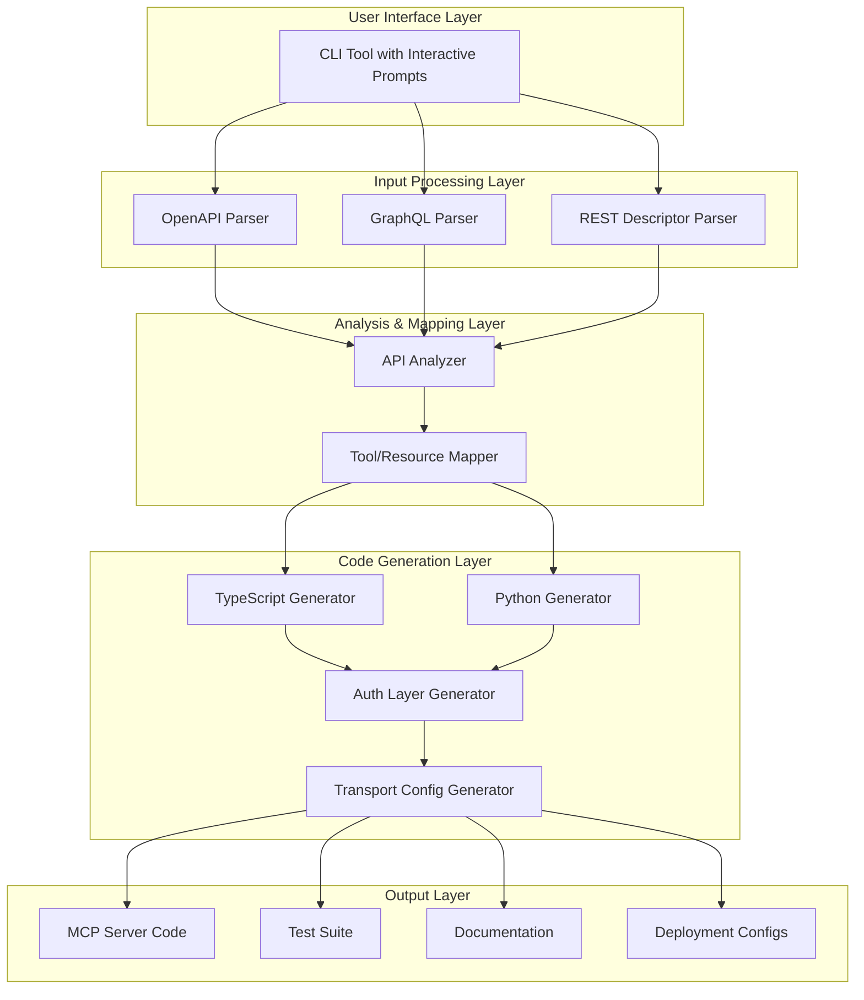
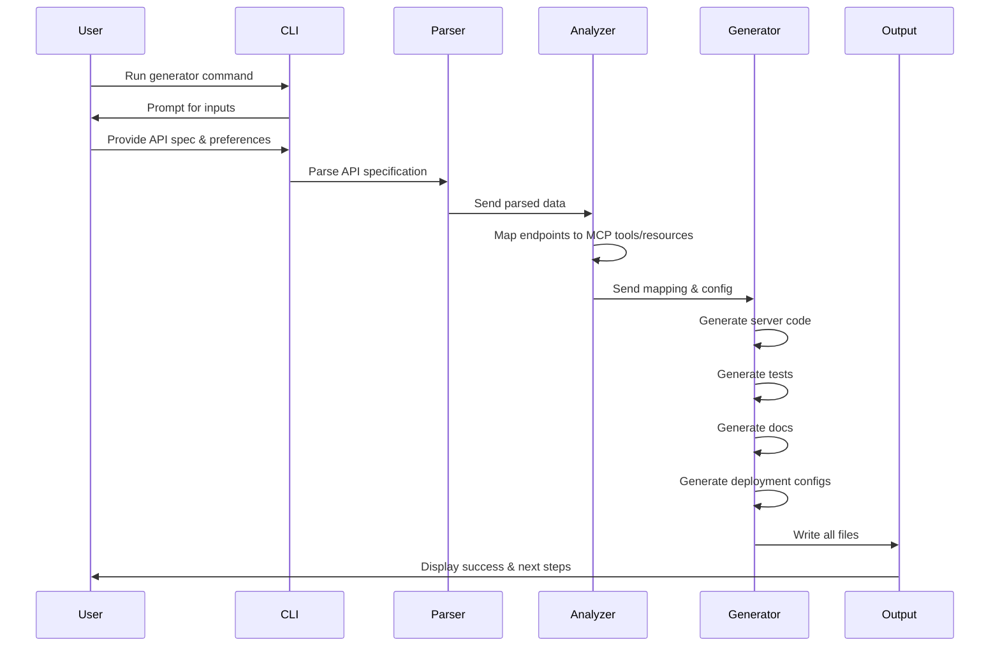

# MCP Server Generator - Architecture

## Overview
An intelligent CLI tool that generates production-ready Model Context Protocol (MCP) servers from API specifications. Supports TypeScript and Python with multiple input formats and comprehensive deployment configurations.

## System Architecture



## Core Components

### 1. CLI Framework
**Technology**: Node.js with TypeScript
**Key Libraries**:
- `commander` - Command-line interface
- `inquirer` - Interactive prompts
- `chalk` - Terminal styling
- `ora` - Loading spinners

**Features**:
- Interactive mode with guided prompts
- Non-interactive mode with CLI arguments
- Progress indicators and status updates
- Error handling and validation

### 2. Input Parsers

#### OpenAPI/Swagger Parser
- Parse OpenAPI 3.x and Swagger 2.0 specifications
- Extract endpoints, parameters, schemas, and authentication
- Validate specification completeness
- Library: `swagger-parser`, `openapi-types`

#### GraphQL Schema Parser
- Parse GraphQL SDL (Schema Definition Language)
- Extract queries, mutations, subscriptions
- Map types to MCP resources
- Library: `graphql`, `@graphql-tools/schema`

#### REST Endpoint Descriptor Parser
- Custom JSON/YAML format for REST APIs
- Flexible endpoint definition
- Support for custom headers and authentication

**Format Example**:
```json
{
  "name": "My API",
  "baseUrl": "https://api.example.com",
  "endpoints": [
    {
      "path": "/users",
      "method": "GET",
      "description": "List all users",
      "parameters": [],
      "response": { "type": "array" }
    }
  ]
}
```

### 3. Analysis & Mapping Engine

#### API Analyzer
- Analyzes parsed API specifications
- Identifies patterns and relationships
- Determines optimal MCP tool/resource mapping
- Generates metadata for code generation

#### Tool/Resource Mapper
**Mapping Strategy**:
- **GET endpoints** → MCP Resources (read-only data)
- **POST/PUT/DELETE endpoints** → MCP Tools (actions)
- **Query parameters** → Tool arguments
- **Path parameters** → Resource identifiers
- **Request bodies** → Tool input schemas

### 4. Code Generators

#### TypeScript Generator
**Output Structure**:
```
generated-server/
├── src/
│   ├── index.ts           # Server entry point
│   ├── tools/             # MCP tools
│   ├── resources/         # MCP resources
│   ├── auth/              # Authentication
│   ├── transport/         # STDIO/HTTP transport
│   └── utils/             # Utilities
├── tests/
├── package.json
├── tsconfig.json
└── README.md
```

**Dependencies**:
- `@modelcontextprotocol/sdk` - MCP SDK
- `zod` - Schema validation
- `axios` - HTTP client
- `winston` - Logging

#### Python Generator
**Output Structure**:
```
generated-server/
├── src/
│   ├── __init__.py
│   ├── server.py          # Server entry point
│   ├── tools/             # MCP tools
│   ├── resources/         # MCP resources
│   ├── auth/              # Authentication
│   └── transport/         # STDIO/HTTP transport
├── tests/
├── requirements.txt
├── pyproject.toml
└── README.md
```

**Dependencies**:
- `mcp` - MCP package
- `fastmcp` - FastMCP framework
- `pydantic` - Data validation
- `httpx` - HTTP client
- `loguru` - Logging

### 5. Authentication Layer

**Supported Methods**:

1. **API Key**
   - Header-based: `X-API-Key`
   - Query parameter: `?api_key=xxx`

2. **Bearer Token**
   - Authorization header: `Bearer <token>`

3. **OAuth2**
   - Authorization Code flow
   - Client Credentials flow
   - Token refresh handling

4. **Basic Auth**
   - Base64 encoded credentials
   - Authorization header: `Basic <credentials>`

**Generated Components**:
- Authentication middleware
- Token management
- Credential storage (environment variables)
- Error handling for auth failures

### 6. Transport Configuration

#### STDIO Transport
- Standard input/output communication
- Ideal for local AI assistants
- JSON-RPC message handling

#### HTTP Transport
- RESTful HTTP endpoints
- WebSocket support for streaming
- CORS configuration
- Rate limiting

### 7. Error Handling & Logging

**Error Handling**:
- Structured error responses
- Error code mapping
- Retry logic for transient failures
- Graceful degradation

**Logging**:
- Structured logging (JSON format)
- Log levels: DEBUG, INFO, WARN, ERROR
- Request/response logging
- Performance metrics

### 8. Test Suite Generator

**Generated Tests**:
- Unit tests for tools and resources
- Integration tests for API calls
- Authentication tests
- Transport tests
- Mock data generation

**Testing Frameworks**:
- TypeScript: `jest`, `supertest`
- Python: `pytest`, `pytest-asyncio`

### 9. Documentation Generator

**Generated Documentation**:
1. **README.md**
   - Installation instructions
   - Configuration guide
   - Usage examples
   - API reference

2. **API Documentation**
   - Tool descriptions
   - Resource schemas
   - Authentication setup
   - Example requests/responses

3. **Deployment Guide**
   - Docker setup
   - Kubernetes deployment
   - Environment variables
   - Troubleshooting

### 10. Deployment Configurations

#### Docker
```dockerfile
FROM node:20-alpine  # or python:3.11-slim
WORKDIR /app
COPY . .
RUN npm install  # or pip install -r requirements.txt
CMD ["npm", "start"]  # or python src/server.py
```

#### docker-compose.yml
- Multi-container setup
- Environment variable configuration
- Volume mounts
- Network configuration

#### Kubernetes
- Deployment manifest
- Service definition
- ConfigMap for configuration
- Secret for credentials
- Ingress for HTTP transport

## Data Flow



## Project Structure

```
mcp-server-generator/
├── src/
│   ├── cli/
│   │   ├── index.ts              # CLI entry point
│   │   ├── prompts.ts            # Interactive prompts
│   │   └── commands.ts           # Command handlers
│   ├── parsers/
│   │   ├── openapi.ts            # OpenAPI parser
│   │   ├── graphql.ts            # GraphQL parser
│   │   └── rest.ts               # REST descriptor parser
│   ├── analyzers/
│   │   ├── api-analyzer.ts       # API analysis
│   │   └── mapper.ts             # Tool/resource mapping
│   ├── generators/
│   │   ├── typescript/
│   │   │   ├── server.ts         # TS server generator
│   │   │   ├── tools.ts          # TS tools generator
│   │   │   ├── resources.ts      # TS resources generator
│   │   │   └── templates/        # TS code templates
│   │   ├── python/
│   │   │   ├── server.ts         # Python server generator
│   │   │   ├── tools.ts          # Python tools generator
│   │   │   ├── resources.ts      # Python resources generator
│   │   │   └── templates/        # Python code templates
│   │   ├── auth.ts               # Auth layer generator
│   │   ├── transport.ts          # Transport config generator
│   │   ├── tests.ts              # Test suite generator
│   │   ├── docs.ts               # Documentation generator
│   │   └── deployment.ts         # Deployment config generator
│   ├── templates/                # Template files
│   └── utils/
│       ├── file-writer.ts        # File operations
│       ├── validator.ts          # Input validation
│       └── logger.ts             # Logging utilities
├── tests/
│   ├── unit/
│   ├── integration/
│   └── fixtures/                 # Sample API specs
├── examples/                     # Example generated servers
├── docs/                         # User documentation
├── package.json
├── tsconfig.json
└── README.md
```

## Technology Stack

### Core
- **Language**: TypeScript (for the generator itself)
- **Runtime**: Node.js 18+
- **Package Manager**: npm or pnpm

### CLI
- `commander` - CLI framework
- `inquirer` - Interactive prompts
- `chalk` - Terminal colors
- `ora` - Spinners

### Parsing
- `swagger-parser` - OpenAPI parsing
- `graphql` - GraphQL parsing
- `js-yaml` - YAML parsing
- `ajv` - JSON schema validation

### Code Generation
- `handlebars` - Template engine
- `prettier` - Code formatting
- `eslint` - Code linting

### Testing
- `jest` - Testing framework
- `ts-jest` - TypeScript support
- `supertest` - HTTP testing

## Implementation Phases

### Phase 1: Foundation (Weeks 1-2)
- Set up project structure
- Implement CLI framework
- Create basic OpenAPI parser
- Build TypeScript generator skeleton

### Phase 2: Core Features (Weeks 3-4)
- Complete all parsers (OpenAPI, GraphQL, REST)
- Implement tool/resource mapping
- Build TypeScript code generator
- Add authentication layer

### Phase 3: Python Support (Week 5)
- Create Python code generator
- Port templates to Python
- Test Python output

### Phase 4: Advanced Features (Week 6)
- Add transport configurations
- Implement test generator
- Build documentation generator
- Create deployment configs

### Phase 5: Polish & Testing (Week 7)
- End-to-end testing
- Documentation
- Example projects
- Bug fixes

### Phase 6: Release (Week 8)
- CI/CD setup
- Package publishing
- Release documentation
- Community outreach

## Success Metrics

1. **Code Quality**
   - Generated code passes linting
   - 90%+ test coverage
   - Type-safe implementations

2. **Usability**
   - < 5 minutes to generate a server
   - Clear error messages
   - Comprehensive documentation

3. **Compatibility**
   - Works with OpenAPI 3.x and Swagger 2.0
   - Supports GraphQL SDL
   - Compatible with major MCP clients

4. **Performance**
   - Generation completes in < 30 seconds
   - Generated servers handle 1000+ req/sec
   - Low memory footprint

## Future Enhancements

1. **Additional Input Formats**
   - Database schema parsing (PostgreSQL, MongoDB)
   - gRPC service definitions
   - AsyncAPI specifications

2. **Advanced Features**
   - Rate limiting configuration
   - Caching strategies
   - Monitoring and observability
   - API versioning support

3. **UI/UX**
   - Web-based UI
   - VS Code extension
   - Real-time preview

4. **Integrations**
   - GitHub Actions workflow
   - Cloud deployment (AWS, GCP, Azure)
   - API gateway integration